# Jarkom-Modul-Y-E09-2023

|Nama Anggota |NRP |
|---|---|
|Thoriq Fatihassalam | 5025201254 |
|Farah Dhia Fadhila | 5025211030 |

## Soal 1
User melakukan berbagai aktivitas dengan menggunakan protokol FTP.  
nc 10.21.78.111 12345

a. Berapakah sequence number (raw) pada packet yang menunjukkan aktivitas tersebut? 
b. Berapakah acknowledge number (raw) pada packet yang menunjukkan aktivitas tersebut? 
c. Berapakah sequence number (raw) pada packet yang menunjukkan response dari aktivitas tersebut? 
d. Berapakah acknowledge number (raw) pada packet yang menunjukkan response dari aktivitas tersebut? 
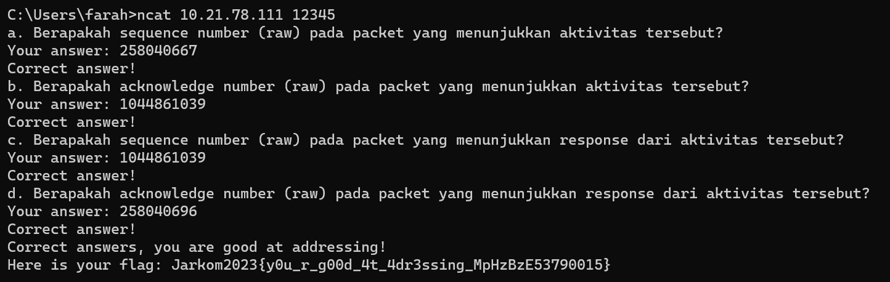

### Jawaban
Pada protokol FTP kita mengenal "STOR" untuk mengupload file ke FTP server. Oleh karena itu saya memfilter packet yang mengandung string "STOR" dengan 
`tcp contains "STOR"`. 
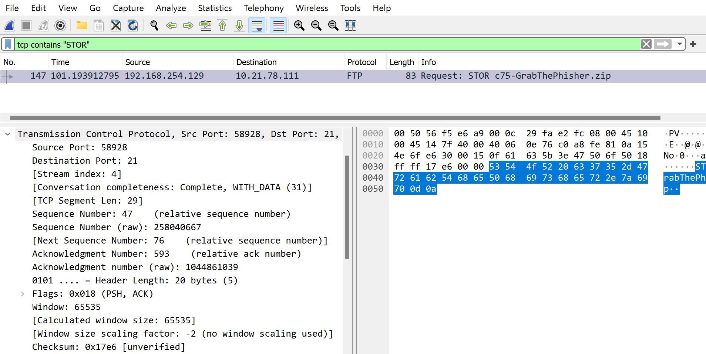

Jika kita klik TCP, akan terlihat sequence number (raw) dan acknowledge number (raw) pada aktivitas tersebut. Lalu akan terlihat juga bahwa file yang diupload bernama **c75-GrabThePhisher.zip**

Lalu kita filter packet yang memiliki string "c75-GrabThePhisher.zip" untuk melihat aktivitas pada packet tersebut.  
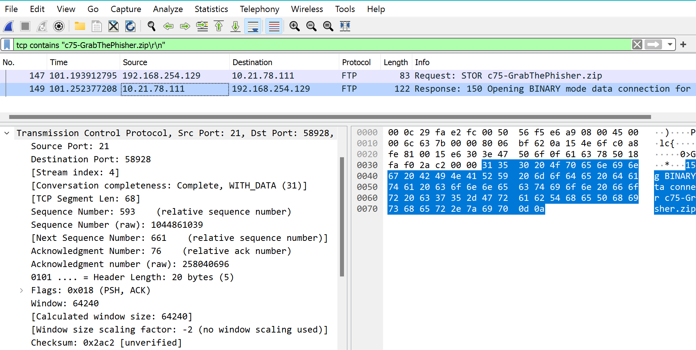

Sama seperti sebelumnya, ketika kita menklik TCP, akan terlihat sequence number (raw) dan acknowlegde number (raw) pada aktivitas tersebut.

## Soal 2
Sebutkan web server yang digunakan pada portal praktikum Jaringan Komputer!  
nc 10.21.78.111 13579  
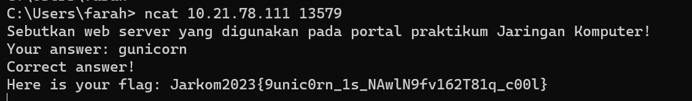

## Jawaban
Seperti yang kita tau bahwa pengerjaan praktikum Jaringan Komputer ini dilakukan pada platform `link http://10.21.78.111:8000/`. Saya memfilter aktivitas yang source ip 10.21.78.111:8000 dnegan `ip.src == 10.21.78.111:8000`  
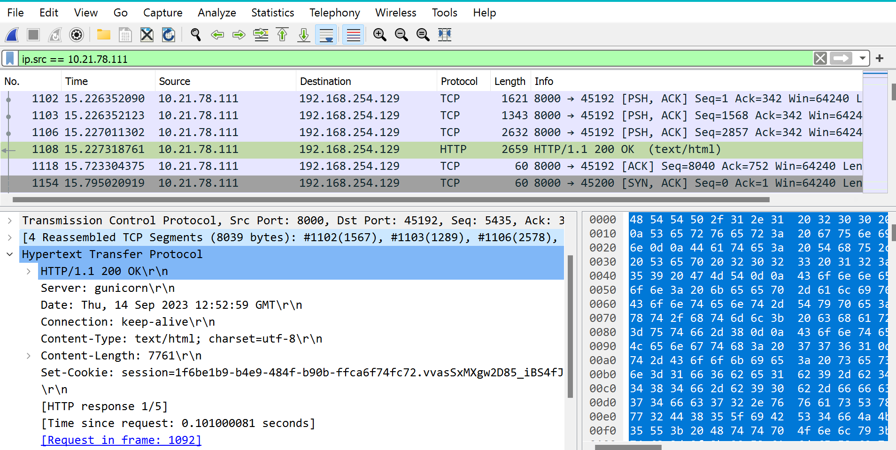

Pada packet tersebut akan terlihat bahwa server yang digunakan adalah gunicorn. Oleh karena itu jawabannya adalah `gunicorn`

## Soal 3
Dapin sedang belajar analisis jaringan. Bantulah Dapin untuk mengerjakan soal berikut:  
nc 10.21.78.111 13590 

a. Berapa banyak paket yang tercapture dengan IP source maupun destination address adalah 239.255.255.250 dengan port 3702? 
b. Protokol layer transport apa yang digunakan?  
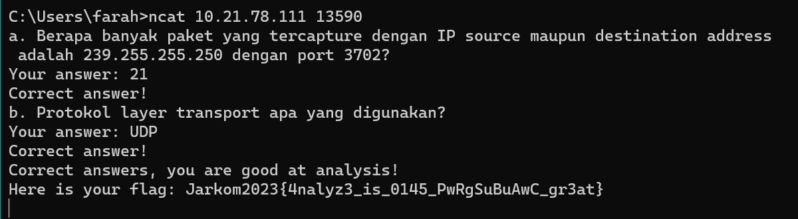

### Jawaban
Untuk soal 3a, saya memfilter IP address 239.255.255.250 dengan port 3702 dengan `ip.addr == 239.255.255.250 && udp.port == 3702`. Lalu kita menseleksi semua aktivitas yang telah terfilter, maka akan terlihat jumlah dari packet yang ada dengan IP source maupun destination address adalah 239.255.255.250 dengan port 3702. 
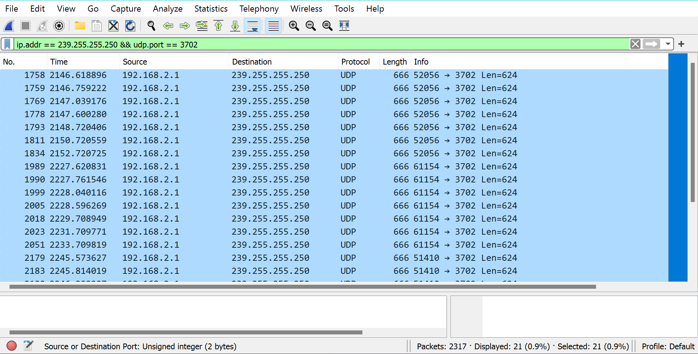

Kita juga bisa mengetahui protokol yang dipakai pada header protocol. Protokol yang digunakan adalah protokol `UDP`

## Soal 4
Berapa nilai checksum yang didapat dari header pada paket nomor 130? 
nc 10.21.78.111 13591  
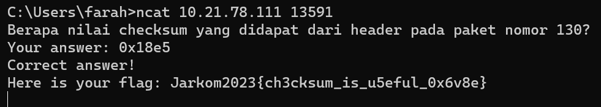

### Jawaban
Pertama kita perlu memfilter paket dengan nomor 130 dengan `frame.number == 130`  
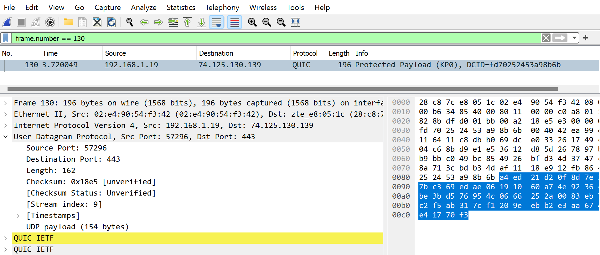

Kita bisa bahwa checksum-nya adalah `0x18e5`

## Soal 5
Elshe menemukan suatu file packet capture yang menarik. Bantulah elshe untuk menganalisis file packet capture tersebut.

### Jawaban
Pertama kita perlu mendownload file soal5.pcap dan zippppfileee.zip lalu menuju file `connect.txt` pada folder s3crett. File txt tersebut harus dibuka dengan password yang perlu kita cari di file pcap. Lalu pada file pcap tersebut saya memfilter packet yang mengandung string "pass" dengan `tcp contains "pass"`  
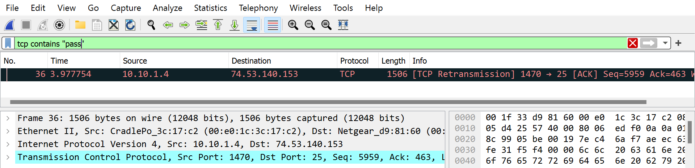

Kita perlu mem-follow TCP Stream lalu akan terlihat passwordnya.  
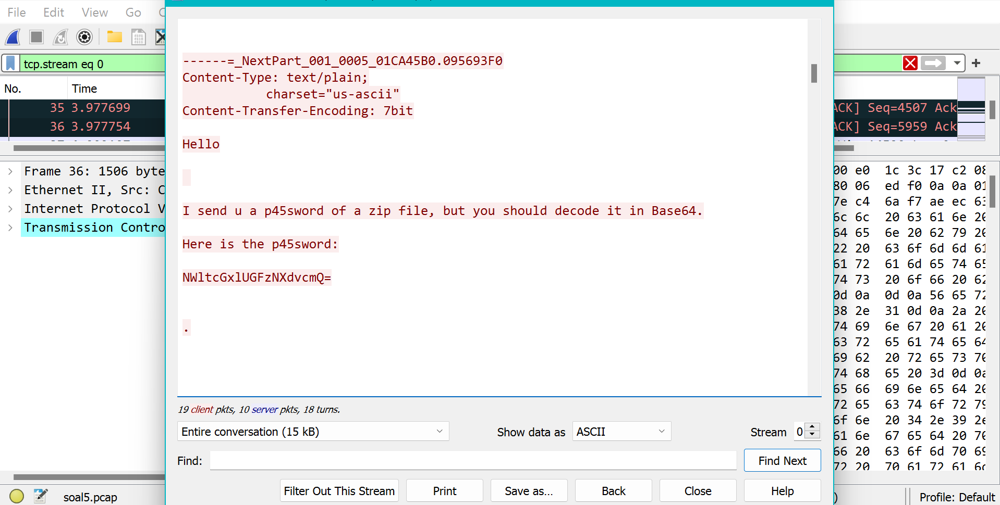

Terlihat bahwa password yang diberikan perlu didecode dengan base64 untuk mendapatkan password sebenarnya. Saya menggunakan bantuan web base64decode.org untuk mendecode password tersebut dan didapatkan password sebenarnya.  
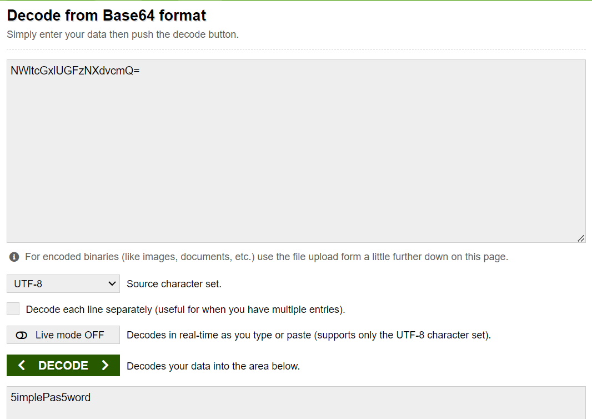

Selanjutnya saya masukkan password yang telah didapat untuk membuka file connect.txt dan mendapatkan netcat-nya. 
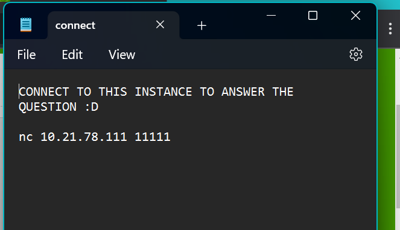

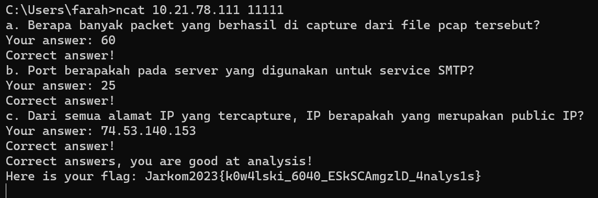
a. Berapa banyak packet yang berhasil di capture dari file pcap tersebut?  
b. Port berapakah pada server yang digunakan untuk service SMTP?  
c. Dari semua alamat IP yang tercapture, IP berapakah yang merupakan public IP?

Untuk soal 5a, kita perlu menseleksi semua aktivitas pada file soal5.pcap lalu akan terlihat bahwa total packet ada `60`. 
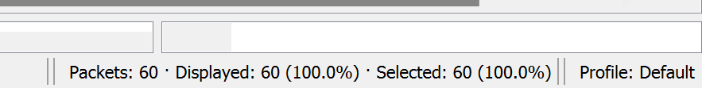

Lalu untuk soal 5b, saya memfilter packet yang menggunakan service SMTP dengan `tcp contains "SMTP"`, maka akan terlihat bahwa port yang digunakan adalah port `25`. 
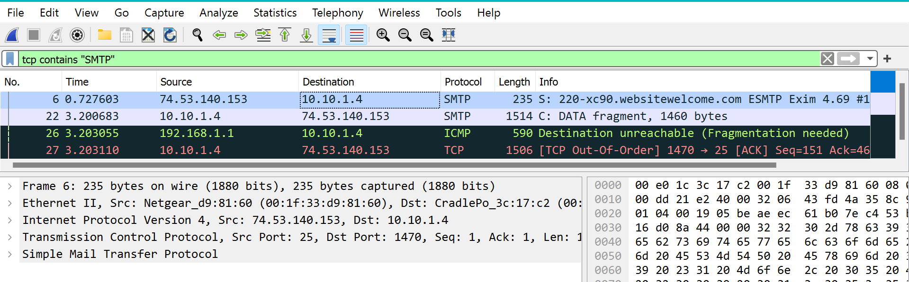

Terakhir, untuk soal 5c alamat IP yang merupakan public IP adalah `74.53.140.153`

## Soal 6
Seorang anak bernama Udin Berteman dengan SlameT yang merupakan seorang penggemar film detektif. sebagai teman yang baik, Ia selalu mengajak slamet untuk bermain valoranT bersama. suatu malam, terjadi sebuah hal yang tak terdUga. ketika udin mereka membuka game tersebut, laptop udin menunjukkan sebuah field text dan Sebuah kode Invalid bertuliskan "server SOURCE ADDRESS 7812 is invalid". ketika ditelusuri di google, hasil pencarian hanya menampilkan a1 e5 u21. jiwa detektif slamet pun bergejolak. bantulah udin dan slamet untuk menemukan solusi kode error tersebut. 
nc 10.21.78.111 6666

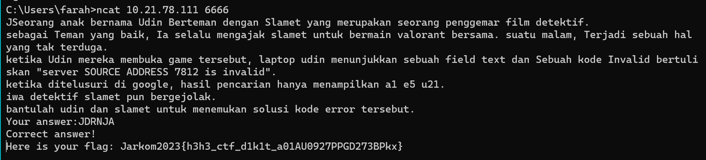

### Jawaban
Pada soal tersebut ada beberapa kejanggalan dalam penulisan yang menjadi hint pertama kami. 
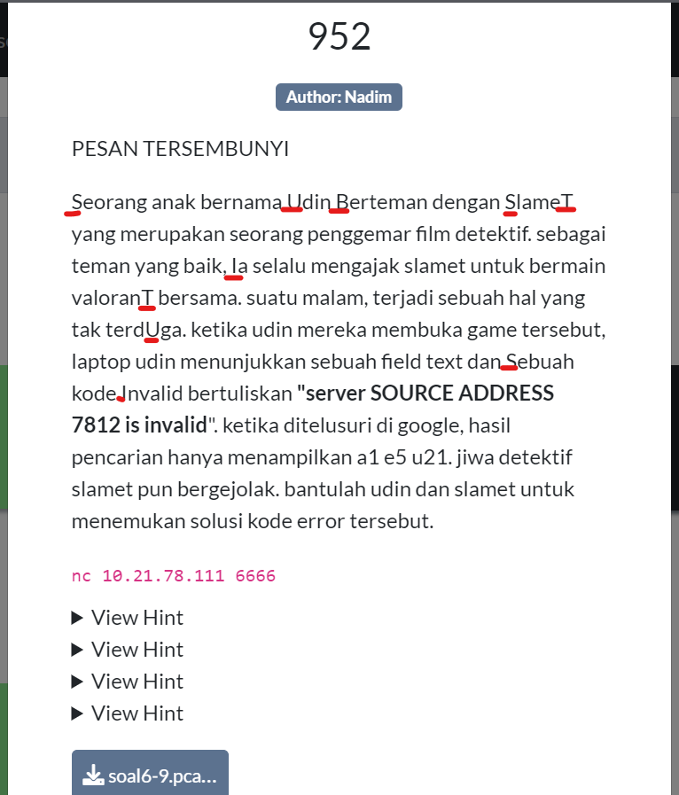

Bisa kita lihat bahwa huruf-huruf kapital tersebut membentuk suatu kata `SUBSTITUSI` yang mana nantinya kita akan substitusi petunjuk berikutnya. Lalu pada soal dikatakan bahwa **"server SOURCE ADDRESS 7812 is invalid"** maka kita perlu mengetahui source address pada packet dengan nomor 7812. Saya memfilter source address dengan nomor packet 7812 dengan `frame.number == 7812` 
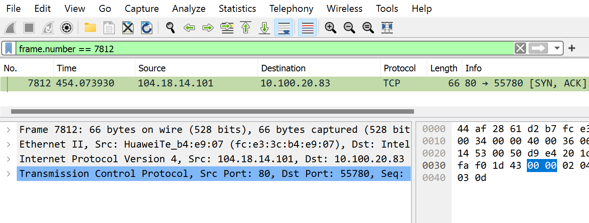

Bisa kita lihat pada packet nomor 7812 memiliki source address `104.18.14.101` selanjutnya kami menggunakan hint yang tertera pada soal yaitu a1 e5 u21, karakter tersebut merupakan sebuah alphabet dan urutannya, seperti a merupakan alphabet ke-1, e merupakan alphabet ke-5, dan u merupakan alphabet ke-21. Oleh karena alphabet hanya sampai 26, maka kita perlu memparsing ip tersebut menjadi angka-angka yang ada pada alphabet. Hasil parsing tersebut adalah `10 4 18 14 10 1` dan jika diubah ke huruf alphabet, maka akan mendapatkan `JDRJNA`. 

## Soal 7
Berapa jumlah packet yang menuju `IP 184.87.193.88`?

### Jawaban
Dengan menggunakan filter `ip.dst == 184.87.193.88` dapat dilihat jumlah packet yang menuju `IP 184.87.193.88` dan packet nya berjumlah 6.

## Soal 8
Berikan kueri filter sehingga wireshark hanya mengambil semua protokol paket yang menuju port 80! (Jika terdapat lebih dari 1 port, maka urutkan sesuai dengan abjad)

### Jawaban
Dengan menggunakan filter `tcp.dstport == 80 || udp.dstport == 80` akan menangkap semua packet yang menuju port 80 baik melalui protokol TCP maupun UDP. 

Untuk mengurutkan sesuai abjad dapat menekan tulisan protocol pada wireshark, maka akan diurutkan sesuai abjad.

## Soal 9
Berikan kueri filter sehingga wireshark hanya mengambil paket yang berasal dari alamat `10.51.40.1` tetapi tidak menuju ke alamat `10.39.55.34`!

### Jawaban
Dengan menggunakan filter `ip.src == 10.51.40.1` maka paket akan di filter hanya berasal dari alamat tersebut, dan dengan menambahkan logical operator && beserta `ip.dst != 10.39.55.34`maka pake yang menuju `10.39.55.34` akan difilter untuk tidak ditampilkan.

## Soal 10
Sebutkan kredensial yang benar ketika user mencoba login menggunakan Telnet

### Jawaban
Dengan menggunakan filter `telnet contains "Password"` saya menemukan 1 packet. Kemudian follow TCP stream nya maka akan terlihat Username dan Password nya.

Huruf yang berwarna biru adalah huruf yang dikirim oleh server ke client. Sedangkan hurif yang berwarna merah adalah huruf yang dikirim oleh client ke server.
maka Username dan Password nya adalah : `dhafin:kesayangannyak0k0`

## Kendala
Kami tidak bisa menyelesaikan soal no 6.
